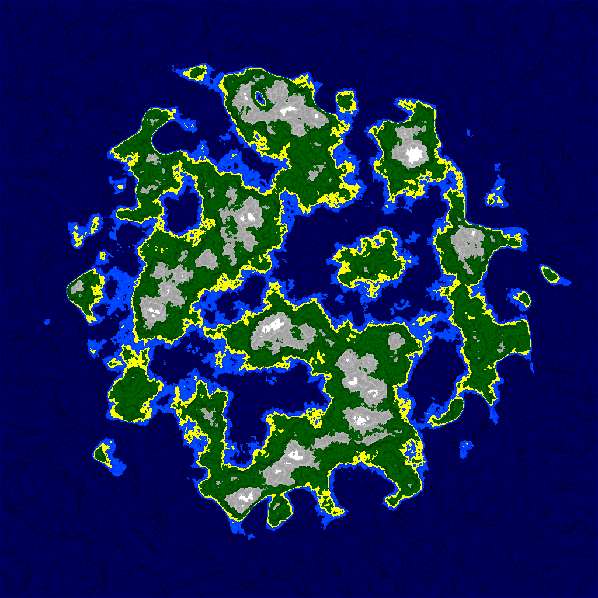

The Worldinator
=======================

Experiment with procedural world generation.

Written in C or C-ish C++.

Work in progress - do not expect particularly nice code. I'm doing this to learn and because it's fun. :)

License
-------

Dual licensed - Choose either MIT or Public Domain, whichever you prefer.

External libraries retain their own license.

Latest generated world
----------------------

Libs used
---------
* https://github.com/nothings/stb/blob/master/stb_image_write.h
* https://github.com/JCash/voronoi
* https://github.com/smcameron/open-simplex-noise-in-c

References
----------
1. https://www.reddit.com/r/proceduralgeneration/
1. https://heredragonsabound.blogspot.se/
1. https://imgur.com/a/bh2iy
1. http://www-cs-students.stanford.edu/~amitp/game-programming/polygon-map-generation/
